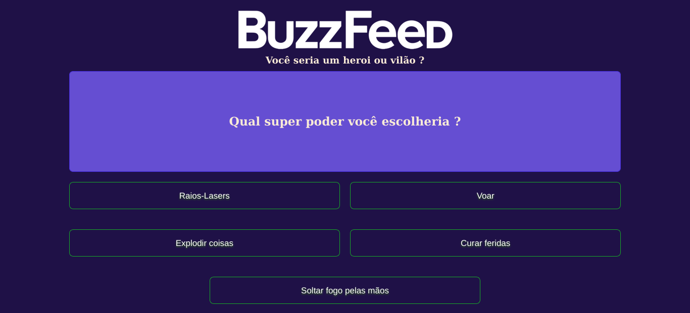

# Sobre o projeto
Esse projeto é um clone de um dos quizzes do buzzfeed proposto pelo bootcamp da DIO 'DecolaTech', para testar habilidades em angular.

## Como testar?
Clone o repositório:
```shell
git clone https://github.com/AlissonLimaG/buzzfeed.git
```
Inicie o servidor de desenvolvedor:
```shell
ng serve -o
```
Pronto, agora o projeto será automaticamente aberto o navegador!

## Capturas de tela

